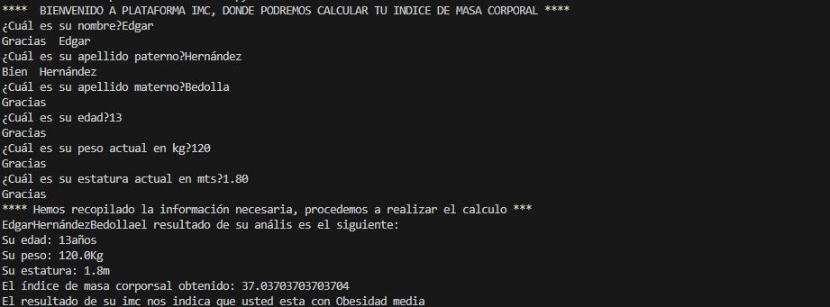

# imc
Desarrollo de calculadora que obtiene le indice de masa corporal

## Desarrollado con
* Python

### Instruccciones
* Es necesario descargar Python en nuestra computadora desde el sitio oficial (https://www.python.org/)
* Una vez instalado Python, hay que clonar el repositorio - (https://github.com/wallace3/imc.git)
* Clonado el repositorio en nuestra maquina, hay que ejecutar el archivo caculatorimc.py

### Cómo funciona 
* El programa preguntará por datos personales necesarios para realizar el cálculo
* Es importante seguir los lineamientos del tipo de dato que se cuestiona, sino, el programa dará un error.
* Y obtendríamos un resultado como se muestra en la imagen a continuación

### Autor
* Ing. Edgar Azael Hernández Bedolla

### Concoimientos
* Softwware desarollado gracias a los conocmientos básicos de uCamp en conjunto con UTEL Universidad
* Python es un lenguaje de programación con bastante tiempo y en constante evolución en el cual me gustaría profesionalizarme.

